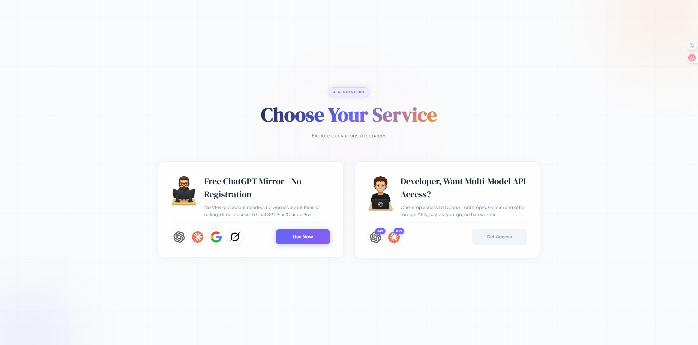
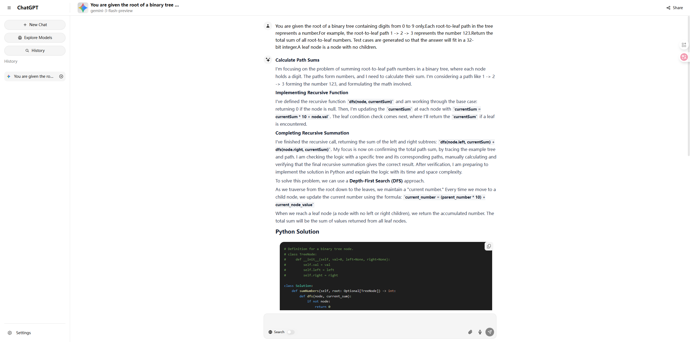
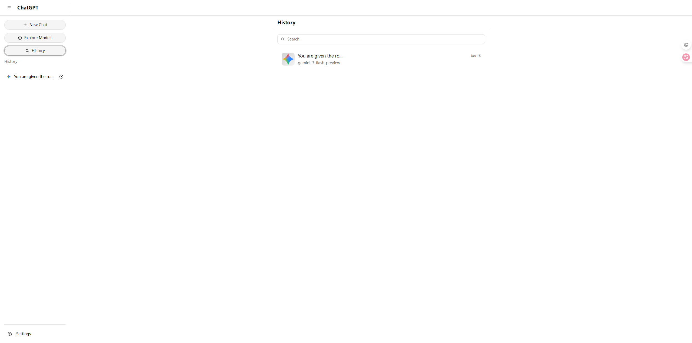
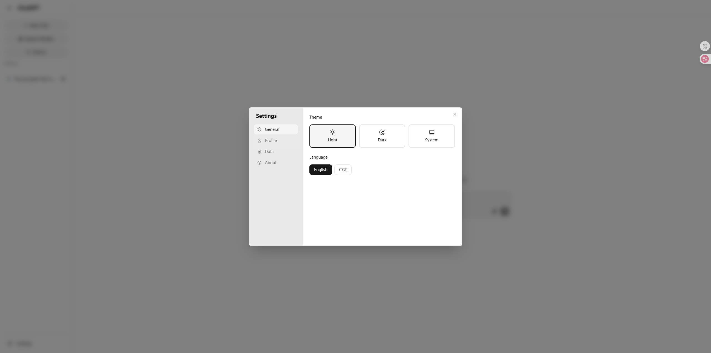

# AI Chat Platform

A full-stack AI chat application featuring a modern Next.js frontend and a high-performance FastAPI backend. The platform enables seamless conversations with multiple AI models including OpenAI, Claude, Gemini, and Grok, with support for file attachments, real-time streaming responses, and comprehensive conversation management.

---

# AI Chat Frontend

A modern, feature-rich AI chat interface built with **Next.js 15**, **React 19**, and **TypeScript**. This frontend application provides a seamless conversational experience with support for multiple AI models, file attachments, and real-time streaming responses.

## Features

### Landing Page

The welcome page provides a clean entry point with options to start chatting or access API services.

---

### Multi-Model Chat

- Support for multiple AI models with category-based filtering
- Real-time model search with pagination and infinite scroll
- Dynamic model switching within conversations
- Model icons and provider information display

---

### Conversational Interface

- **Real-time Streaming**: Server-sent events (SSE) for instant AI response streaming
- **Rich Markdown Rendering**: Full markdown support with syntax highlighting for code blocks
- **LaTeX/KaTeX Support**: Mathematical equation rendering with remark-math and rehype-katex
- **GitHub Flavored Markdown**: Tables, task lists, and extended markdown features

---

### Conversation Management

- Persistent conversation history with search functionality
- Infinite scroll loading for chat history
- Conversation deletion with confirmation dialogs
- Session-based chat organization

---

### Share & Collaboration

- Share conversations via public links
- Toggle share status for individual conversations
- Read-only shared conversation view for recipients

---

### Settings & Preferences

- User profile management
- Language switching (internationalization ready)
- Theme toggle (dark/light mode)
- Logout functionality

---

### File Attachments

- Multi-file upload with drag-and-drop support
- Pre-signed URL upload to S3-compatible storage
- Support for various file types: images, PDFs, documents, audio, and video
- File processing integration for document text extraction
- Gemini Files API integration for enhanced file handling

### Voice Input

- Speech-to-text functionality using Web Speech API
- Multi-language recognition support (Chinese & English)
- Real-time voice transcription

### Advanced Chat Tools

- **Web Search Toggle**: Enable/disable web search enhancement for responses
- **Reasoning Mode**: Configurable reasoning effort levels (low, medium, high)
- **Video Generation Parameters**: Resolution and duration settings for video-capable models
- **Image Generation**: Toggle for image generation capabilities

### Responsive Design

- Mobile-first responsive layout
- Collapsible sidebar for conversation history
- Touch-friendly interface with proper mobile optimizations
- Dark/Light theme support with system preference detection

### Authentication

- SMS verification code login/registration
- JWT token-based authentication with automatic refresh
- Secure token storage and management
- Protected routes with authentication guards

---

### Modern UI/UX

- Built with Radix UI primitives for accessibility
- Tailwind CSS for styling with custom animations
- Toast notifications using Sonner
- Loading states and skeleton placeholders
- Smooth transitions and micro-interactions

## Tech Stack

| Category         | Technologies                             |
| ---------------- | ---------------------------------------- |
| Framework        | Next.js 15, React 19                     |
| Language         | TypeScript                               |
| Styling          | Tailwind CSS 4, CSS Variables            |
| UI Components    | Radix UI, Lucide React Icons             |
| State Management | React Context, Zustand                   |
| HTTP Client      | Axios, Fetch API                         |
| Markdown         | react-markdown, remark-gfm, rehype-katex |
| Forms            | React Hook Form, Zod validation          |
| Utilities        | lodash-es, uuid, clsx                    |

## Backend

A high-performance AI chat backend service built with **FastAPI**, featuring multi-provider LLM integration and a scalable three-layer architecture.

### Multi-Provider LLM Integration

The backend supports seamless integration with multiple AI providers through a unified adapter pattern:

- **OpenAI** - GPT models with streaming chat completions
- **Anthropic (Claude)** - Claude models for advanced reasoning
- **Google (Gemini)** - Gemini models with native file upload support
- **xAI (Grok)** - Grok models integration

Each provider adapter handles API-specific formatting, streaming responses, and error handling while exposing a consistent interface to the rest of the application.

### Conversation Management

- **Create, Read, Update, Delete** - Complete CRUD operations for conversations
- **Message History** - Retrieve and paginate through conversation messages
- **Conversation Sharing** - Toggle public sharing status for conversations
- **Search** - Fuzzy search across conversation titles and message content
- **Streaming Responses** - Real-time streaming of AI-generated responses via Server-Sent Events (SSE)

### Authentication and User Management

- **SMS Verification** - Phone-based login with verification codes via Alibaba Cloud SMS
- **Password Login** - Traditional username/password authentication
- **JWT Tokens** - Secure access and refresh token mechanism
- **Auto-Registration** - Automatic user creation on first SMS login

### File Storage and Processing

- **Cloud Storage** - Cloudflare R2 (S3-compatible) for file uploads
- **Pre-signed URLs** - Secure direct uploads from client to storage
- **File Processing** - Automatic text extraction from documents (PDF, DOCX, PPTX, Excel, Markdown)
- **Gemini Files API** - Native integration for uploading files directly to Google's Gemini API
- **Redis Caching** - Extracted text content cached for efficient retrieval

Supported file types for text extraction:

- PDF documents
- Microsoft Word (.docx)
- Microsoft PowerPoint (.pptx)
- Microsoft Excel (.xlsx)
- Markdown files
- Plain text files

### Model and Category Management

- **Model Registry** - Database-driven model configuration with enable/disable support
- **Category System** - Organize models into categories (Text Generation, Image Generation, etc.)
- **API Key Management** - Weighted selection algorithm for load balancing across multiple API keys
- **Dynamic Configuration** - Models and API keys managed via database without code changes

### Data Architecture

Hybrid database approach:

- **MySQL + SQLAlchemy** - Relational data (users, models, API keys, categories)
- **MongoDB** - Document storage for conversations and messages
- **Redis** - Caching layer for sessions, verification codes, and extracted file content
- **Alembic** - Database migration management

### Architecture

The application follows a **three-layer architecture**:

1. **API Layer** (`/api`) - HTTP endpoints, request validation, response formatting
2. **Service Layer** (`/services`) - Business logic, provider orchestration, data processing
3. **Repository Layer** (`/repositories`) - Database operations, data access abstraction

### Tech Stack

| Component      | Technology                   |
| -------------- | ---------------------------- |
| Framework      | FastAPI                      |
| ORM            | SQLAlchemy (async)           |
| Relational DB  | MySQL (asyncmy driver)       |
| Document DB    | MongoDB (motor async driver) |
| Cache          | Redis                        |
| Object Storage | Cloudflare R2 (S3-compatible)|
| SMS Service    | Alibaba Cloud SMS            |
| Authentication | JWT (PyJWT)                  |
| Logging        | Loguru                       |
| Migration      | Alembic                      |
